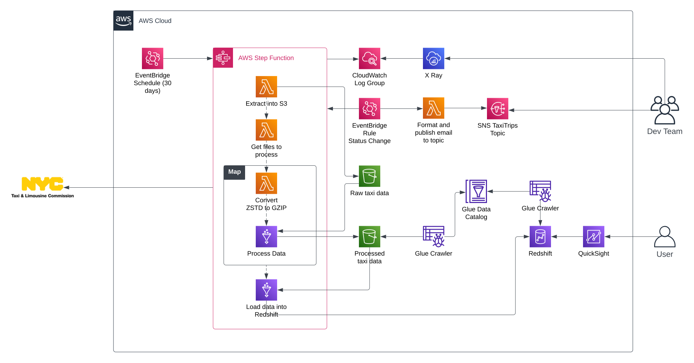

# aws-taxi-trips

Analyzing taxi trips data from [NYC Taxi & Limousine Commission](https://www.nyc.gov/html/tlc/html/about/trip_record_data.shtml) and generating insights aimed at solving ecological and business-related questions.

## Data Source and Structure

The [NYC Taxi & Limousine Commission](https://www.nyc.gov/html/tlc/html/about/trip_record_data.shtml) publishes monthly data for taxi trips in the city, the data  include fields capturing pick-up and drop-off dates/times, pick-up and drop-off locations, trip distances, itemized fares, rate types, payment types, and driver-reported passenger counts, and more. Here's the [data dictionary](https://www.nyc.gov/assets/tlc/downloads/pdf/data_dictionary_trip_records_yellow.pdf).

This is the schema definition from the parquet files published in the website:
```
trip
|-- VendorID: long
|-- tpep_pickup_datetime: timestamp
|-- tpep_dropoff_datetime: timestamp
|-- passenger_count: double
|-- trip_distance: double
|-- RatecodeID: double
|-- store_and_fwd_flag: string
|-- PULocationID: long
|-- DOLocationID: long
|-- payment_type: long
|-- fare_amount: double
|-- extra: double
|-- mta_tax: double
|-- tip_amount: double
|-- tolls_amount: double
|-- improvement_surcharge: double
|-- total_amount: double
|-- congestion_surcharge: double
|-- airport_fee: double
```

## Data Processing and AWS Architecture

High level explanation of the data processing steps:

1. Parquet files are mined from the NYC Taxi & Limousine Commission website and loaded to the `raw-taxi-data` bucket.
2. It's then processed for cleaning and transformation by a Glue Job and then loaded to the `processed-taxi-data` bucket.
3. A Glue Job consumes data from `processed-taxi-data` and loads it into Redshift.


Actual solution's diagram:



### Challenges and architectural reasoning

#### Schema mismatch and compression issues

Data is published by The NYC Taxi & Limousine Commission as parquet files representing data for each month. These parquets files might declare different schema definitions (resulting in a schema evolution issue) and are compressed using either ZSTD or GZIP.

As of the making of this project, [Glue itself doesn't properly support ZSTD compression in parquet files](https://books.google.com.co/books?id=UKF9EAAAQBAJ&pg=PA96&lpg=PA96&dq=read+%22zstd%22+parquet+files+glue+job&source=bl&ots=QnJDqYeFZF&sig=ACfU3U2MV2OLqovFOADR-lDVf-S7fzYE1Q&hl=en&sa=X&ved=2ahUKEwiiutry-eOAAxWzSDABHRpTDd0Q6AF6BAgqEAM#v=onepage&q=read%20%22zstd%22%20parquet%20files%20glue%20job&f=false). Another option would have been to use EMR and install the proper libraries to work with ZSTD compression but I though of this solution to be overkill due to, for example, being costier and the data itself not being that large to justify EMR. A simple lambda function was created instead to make the conversion.

#### Orchestration with Step Functions and EventBridge
Steps functions was a no-brainer choice for orchestrating the workflow, and an EventBridge Schedule runs the machine on a 30-days rate.

The state machine was created with simplification in mind and avoiding Choices and other kind of branching. It is also able to continue work from a specific Step if there's any error, to understand how this was achieved, here's an explanation for each Step:

* `Extract into S3` only extracts parquet files and load them into S3
* `Get files to process` compares the `raw-taxi-data` and `processed-taxi-data` buckets "folder structure", specifically it checks the diff in folder partitions (`yyyy=year/mm=mm`) between the buckets, so if a folder partition is missing in the `processed-taxi-data` bucket it means it was previously extracted but not worked on. The lambda returns an array of these partitions that haven't been worked on and the `Map` is executed independtly of having or not having files to process.
* `Convert ZSTD to GZIP` only converts file that are not marked as `already-gzipped` which is metadata set to files, otherwise it just returns a valid response.
* `Process Data` runs for each file in the array and then loads it into `processed-taxi-data`
* `Load data into Redshift` uses job bookmarks to know which if there's new data to load.

#### Cool notifications with SNS and X Ray for debugging
An EventBridge rule notifies a lambda of all status changes in the machine, the lambda creates a cool email and publishes it to every email-loving javascript-enjoyer person who subscribes to the SNS topic.

X Ray is set up as a way to debug the state machine if anything happens.

## Data Visualization 
Insights are generated using Quicksight, and it was interesting to see that on **saturdays at midnight** (according to the heat map) the taxi demand is one of the highest. I wonder why. Anyway, these are other insights:

* Most taxi trips are made within Manhattan itself, and the second most common pickup-dropoff pair is Manhattan-Queens.

* People love credit cards in NYC for paying their taxis.

* Having 4 passengers in your taxi means you're getting paid more, on average $4 more than having only 1 passenger.


